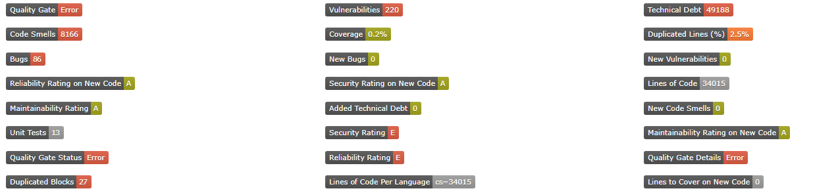

# HoNoSoFt.badgeIt.SonarQube
[](https://ci.appveyor.com/project/Nordes/honosoft-badgeit-sonarqube)

Badge your SonarQube results within your Confluence page or anywhere else (GitHub, GitLab, etc.).

## What does it uses under the hood

* SonarQube server with API Key generated from an account
* Shield.io (Official site, but can be overriden in the config if you prefer to install locally)
  * Maybe usage of local nodeJs server might happen in the futur.

## Configuration

In your configuration file `appsettings.json` you will need to add the following section:

```json
  "SonarQube":{
    "ApiKey": "[YOUR API KEY]",
    "BaseUri": "https://[YOUR.SonarQube.BaseUri]/"
  }
```

## How to use

Install in your directory where you want to use it, then execute the command `dotnet run` over the web project. However, you must setup the API key and your SonarQube server URL.

## API URI's

- **Key:** The SonarQube key (i.e.: `Project:branch`) 
- **Available metrics**
  - `QualityGate`: Quality gate status (ERROR, etc.)
  - `QualityGateDetails`: ...
  - `Vulnerabilities`: Quantity of vulnerabilities.
  - `NewVulnerabilities`: ...
  - `SqaleIndex`: ...
  - `SqaleRating`: ...
  - `CodeSmells`: Total quantity of code smells
  - `NewCodeSmells`: New code smells
  - `Coverage`: Sum of the code coverage within the project branch
  - `DuplicatedLinesDensity`: Percentage of duplicated lines within the NCLOC.
  - `Bugs`: Total quantity of bugs within the project.
  - `NewBugs`: ...
  - `ReliabilityRating`: ...
  - `NewReliabilityRating`: ...
  - `NewSecurityRating`: ...
  - `Ncloc`: Number of line of code
  - `NclocLanguageDistribution`: Number of line of code by languages
  - `NewTechnicalDebt`: New technical debt
  - `NewLinesToCover`: ...
  - `NewMaintainabilityRating`: ...
  - `Tests`: Number of tests
  - `SecurityRating`: ...
  - `AlertStatus`: ...
  - `DuplicatedBlocks`: ...

| API | Description |
|----|----|
| /api/badges/key=`{key}` | By default, return the Quality Gate Status |
| /api/badges/key=`{key}`&metric=`{metric}` | Return the badge based on the requested metric |


(The api Example can be seen from the default page)

## Example of output 



## License


